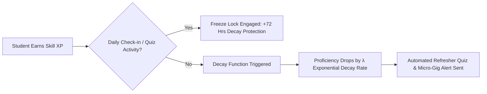

# JOBLEX — Comprehensive Project Methodology & Technical Specifications

> **Universal Academia-Industry Collaboration & Career Acceleration Platform**  
> *Target Problem Statement ID: 26044 | Ministry of Ayush & Corporate Industry Partners*

---

## 🌟 Executive Overview

Traditional career platforms operate as **open-loop, static job boards**: candidates upload unverified CVs, recruiters post generic requisitions, and academic institutions update curricula on multi-year cycles. This creates a severe structural mismatch between graduate skill sets and real-time industrial demand.

**JOBLEX** resolves this systemic inefficiency through a **closed-loop digital ecosystem**. Driven by an 85+ skill canonical ontology, hybrid vector-matching mathematics, gamified anti-decay retention mechanics, zero-trust cryptographic verification, and AI-driven NEP-2020 syllabus synthesis, JOBLEX establishes a continuous alignment pipeline across Students, Industry Recruiters, and University Deans.

```
┌────────────────────────────────────────────────────────────────────────────────────────────────────────┐
│                                       JOBLEX METHODOLOGY PIPELINE                                      │
└────────────────────────────────────────────────────────────────────────────────────────────────────────┘
                                                    │
        ┌───────────────────────────────────────────┼───────────────────────────────────────────┐
        ▼                                           ▼                                           ▼
┌───────────────────────────────┐       ┌───────────────────────────────┐       ┌───────────────────────────────┐
│     PHASE 1: INGESTION        │       │      PHASE 2: MATCHING        │       │ PHASE 3: RETENTION & GIGS     │
│ • NLP Resume Parsing          │  ───► │ • Cosine Similarity Vector    │  ───► │ • Skill Anti-Decay Protection │
│ • 85+ Canonical Skill Mapping │       │ • Weighted Jaccard Index      │       │ • Micro-Internship Engine     │
│ • Synonym Normalization       │       │ • Match Score Calculation     │       │ • Zulu AI Guidance Companion  │
└───────────────────────────────┘       └───────────────────────────────┘       └───────────────────────────────┘
                                                                                                │
        ┌───────────────────────────────────────────────────────────────────────────────────────┘
        ▼
┌───────────────────────────────┐       ┌───────────────────────────────┐
│   PHASE 4: ACADEMIC GOVERNANCE│       │ PHASE 5: ZERO-TRUST SECURITY  │
│ • Industry Demand Transmission│  ───► │ • SHA-256 HMAC Badge Signing  │
│ • NEP-2020 Syllabus AI        │       │ • Public Verification API     │
│ • Peer Institutional Bench    │       │ • Off-Chain Audit Trail       │
└───────────────────────────────┘       └───────────────────────────────┘
```

---

## 🏛️ Phase 1: Canonical Skill Ontology & NLP Ingestion Engine

Rather than relying on basic keyword substring matching, JOBLEX utilizes a structured **Domain Skill Taxonomy** ([skillOntology.js](file:///a:/ProgrammingCodes/Projects/SIH%2026/mainsihrepo/backend/data/skillOntology.js)) encompassing 85+ skills across 5 core domains:

1. **Ayush Pharmacology & Phytochemistry**: Herbal Formulation, HPTLC Fingerprinting, HPLC Analysis, GLP/GMP Compliance, Spectrophotometry, Traditional Toxicology.
2. **Health-Tech & Bioinformatics**: In-Silico Molecular Docking, Classical Sanskrit NLP, Health Informatics, ADMET Prediction, Network Pharmacology.
3. **Computer Science & Software Engineering**: Python, Node.js, Express, React, RESTful APIs, PostgreSQL, Docker, Microservices, Security.
4. **Data Science & Artificial Intelligence**: Machine Learning, PyTorch, LLMs & Prompting, Vector Embeddings, MLOps, Computer Vision.
5. **Aptitude & Soft Skills**: Scientific Documentation, Regulatory Audit Readiness, Grant Management, Quantitative Reasoning.

### CV Parsing & Alias Normalization Algorithm
When a candidate submits a raw CV or profile summary:
1. **Tokenization & N-Gram Extraction**: Text is converted to lower-case tokens and parsed for uni-grams, bi-grams, and tri-grams.
2. **Synonym Hash Map Resolution**: Extracted terms are checked against alias dictionaries (e.g., `"hptlc"` $\rightarrow$ `HPTLC Fingerprinting`, `"dravyaguna"` $\rightarrow$ `Ayurvedic Pharmacognosy`).
3. **Proficiency Assignment**: Experience depth, project frequency, and test validations derive candidate proficiency values $P_i \in [0.0, 1.0]$.

---

## 🧮 Phase 2: Dual Hybrid Vector-Matching Mathematics Engine

JOBLEX quantifies candidate-to-opportunity fit through a hybrid mathematical model combining **directional vector alignment** with **mandatory set overlap ratio**.

### Mathematical Formulations

$$\text{Match Score} = w_c \cdot \cos(\theta) + w_j \cdot J(A, B)$$

Where:
* **Cosine Similarity ($\cos\theta$)** (Category Directional Alignment, $w_c = 0.6$):
  Calculates the angle between the weighted candidate skill vector $\mathbf{A}$ and job requirement vector $\mathbf{B}$:

  $$\cos(\theta) = \frac{\mathbf{A} \cdot \mathbf{B}}{\|\mathbf{A}\| \|\mathbf{B}\|} = \frac{\sum_{i=1}^{n} A_i B_i}{\sqrt{\sum_{i=1}^{n} A_i^2} \sqrt{\sum_{i=1}^{n} B_i^2}}$$

* **Weighted Jaccard Index ($J(A, B)$)** (Core Skill Set Overlap, $w_j = 0.4$):
  Evaluates exact match ratio over mandatory core competencies:

  $$J(A, B) = \frac{\sum_{k \in (A \cap B)} \min(A_k, B_k)}{\sum_{k \in (A \cup B)} \max(A_k, B_k)}$$

> [!IMPORTANT]
> This dual formulation ensures candidates with strong overall domain direction (Cosine) are rewarded, while strictly enforcing hard prerequisite skill requirements (Jaccard).

---

## 🎮 Phase 3: Gamified Skill Anti-Decay & Micro-Gig Engine

To solve the "stale resume" issue where learned skills degrade over time, JOBLEX implements a **Gamified Retention Engine** integrated directly into the Student Portal ([student.html](file:///a:/ProgrammingCodes/Projects/SIH%2026/mainsihrepo/student.html)).



### Key Components:
1. **Exponential Skill Decay Function**:
   $$P(t) = P_0 \cdot e^{-\lambda t}$$
   Where $P_0$ is initial proficiency, $\lambda$ is domain decay constant, and $t$ is days of inactivity.
2. **72-Hour Freeze Lock**: Daily check-ins or quiz completions freeze the decay counter $t \to 0$.
3. **Micro-Internship / Paid Gig Marketplace**: 1-2 week task-based deliverables (stipends ₹4,500 - ₹8,000) allowing industry recruiters to evaluate candidates on real deliverables before full hiring.
4. **Zulu AI Career Counselor**: Context-aware conversational assistant providing interview prep, project suggestions, and remedial learning paths.

---

## 🏫 Phase 4: Closed-Loop AI Syllabus Modernization (NEP-2020)

JOBLEX bridges the gap between industrial hiring needs and university governance through the Academy Portal ([academy.html](file:///a:/ProgrammingCodes/Projects/SIH%2026/mainsihrepo/academy.html)).

```
┌───────────────────────────┐      ┌───────────────────────────┐      ┌───────────────────────────┐
│     INDUSTRY RECRUITER    │      │    JOBLEX AI SYNTHESIZER   │      │       ACADEMIC DEAN       │
│ Identifies candidate skill│ ───► │ Analyzes aggregate demand │ ───► │ Receives accredited syllabus│
│ deficits in recruitment   │      │ matrix against syllabi    │      │ recommendations (NEP-2020)│
└───────────────────────────┘      └───────────────────────────┘      └───────────────────────────┘
```

1. **Reverse Skill Demand Transmission**: Recruiters flag emergent skill deficits during candidate searches, sending structured signals to academic councils.
2. **NEP-2020 AI Syllabus Synthesizer**: Parses existing departmental syllabi and automatically formulates credit-bearing course additions (e.g., adding *HPTLC Fingerprinting* to B.Pharm curricula).
3. **Institutional Peer Benchmarking**: Displays anonymized percentile charts comparing cohort readiness against regional and national peer institutions.
4. **Bilateral MoU & FDP Management**: Tracks corporate-academic MoUs, faculty development programs, and joint research grants.

---

## 🔐 Phase 5: Zero-Trust Cryptographic Credential Engine

To eliminate resume fraud, every certificate and badge issued on JOBLEX is cryptographically verified using SHA-256 HMAC algorithms ([README.md](file:///a:/ProgrammingCodes/Projects/SIH%2026/mainsihrepo/README.md#L86-L96)).

### Verification Protocol
1. **Issuance**: When a student completes an assessment, a payload $M = \{\text{student\_id}, \text{skill\_id}, \text{score}, \text{timestamp}\}$ is created.
2. **Token Generation**:
   $$\text{Token} = \text{HMAC-SHA256}(K_{\text{institutional}}, M)$$
3. **Public Endpoint Validation**: Anyone can query `/api/assessment/verify/:token`. The server validates the token against $K_{\text{institutional}}$ and returns signed badge metadata without requiring authentication.

---

## ⚡ Phase 6: Dual-Runtime Infrastructure & Offline Resilience

Designed for reliability during live high-stakes demonstrations and offline evaluations, JOBLEX implements a **Dual-Runtime Microservices Architecture** ([tech.md](file:///a:/ProgrammingCodes/Projects/SIH%2026/mainsihrepo/tech.md)):

* **Primary Runtime**: Node.js Express 5 (`backend/server.js`).
* **Secondary Mirror Runtime**: Python 3.10+ Flask 3.0+ (`backend/app.py`).
* **Supabase Cloud + In-Memory Fallback State Machine**: If Supabase cloud database connectivity drops, both backends instantly switch to an in-memory database store (`backend/data/database.js`) pre-seeded with 4 persona accounts:
  1. **Student**: Ashay Verma (All India Institute of Ayurveda, 1450 XP)
  2. **Academic Dean**: Dr. Sunita Sharma (AIIA Academic Council)
  3. **Industry HR**: Rajesh Malhotra (Head of Talent, Dabur R&D)
  4. **Platform Admin**: Dr. Rajesh Kotecha (Nodal Officer, Ministry of Ayush)

---

## 📊 Summary: Competitive Advantage Matrix

| Feature | Standard Job Portals (LinkedIn, Unstop) | JOBLEX Platform |
| :--- | :--- | :--- |
| **Matching Logic** | Keyword search / static filters | **Hybrid Cosine-Jaccard Vector Math** |
| **Skill Longevity** | Static, unverified CV claims | **Gamified Exponential Anti-Decay Engine** |
| **Academic Integration** | Zero connection to university syllabi | **NEP-2020 AI Syllabus Synthesizer** |
| **Credential Trust** | Unverified self-reported PDFs | **SHA-256 HMAC Zero-Trust Public API** |
| **Low-Commitment Hiring** | Standard 2-6 month internships | **1-2 Week Task-Based Paid Micro-Gigs** |
| **Evaluation Reliability** | Relies 100% on external Wi-Fi/Cloud | **Dual Backend + In-Memory Judge Fallback** |

---
*Developed for Smart India Hackathon | Enterprise Open-Architecture Solution*
