# JOBLEX — Autonomous Career Intelligence & Industry-Academia Syndication Ecosystem

[]()
[]()
[]()
[]()

---

## 🌟 Executive System Overview

**JOBLEX** is an advanced digital prototype engineered to solve the systemic disconnect between higher education curricula, student skill development, and industrial hiring demands. 

Traditional talent acquisition operates on fragmented, unverified self-reporting, while universities struggle with slow curriculum modernization cycles. JOBLEX establishes a unified, tri-directional data network connecting **Students**, **Academic Institutions**, and **Corporate Employers** into a real-time competency exchange.

Through a hybrid model combining **NLP resume parsing**, **mathematical vector matching**, **interactive skill constellation graphs**, **cryptographic credential proofs**, and **automated curriculum audit engines**, JOBLEX transforms talent discovery and academic alignment from a seasonal bottleneck into a continuous, data-transparent pipeline.

```
                                  ┌─────────────────────────────────────────┐
                                  │           JOBLEX CORE ENGINE            │
                                  │   (Node.js / Express & Python / Flask)  │
                                  └────────────────────┬────────────────────┘
                                                       │
          ┌─────────────────────────────────────────────┼─────────────────────────────────────────────┐
          ▼                                             ▼                                             ▼
┌─────────────────────────┐               ┌─────────────────────────┐               ┌─────────────────────────┐
│     STUDENT PORTAL      │               │    INDUSTRY PORTAL      │               │     ACADEMY PORTAL      │
│ ── ── ── ── ── ── ── ── │               │ ── ── ── ── ── ── ── ── │               │ ── ── ── ── ── ── ── ── │
│ • Gamified Skill Tree   │               │ • Candidate Dossiers    │               │ • Peer Benchmarking     │
│ • Anti-Decay Protection │               │ • Requisition Publisher │               │ • Curriculum Gap AI     │
│ • NLP Resume Analyzer   │               │ • Direct Inbound Invite │               │ • Bilateral MoU Tracker │
│ • Zulu AI Companion     │               │ • Algorithmic Matcher   │               │ • Department Readiness  │
└─────────────────────────┘               └─────────────────────────┘               └─────────────────────────┘
```

---

## 🏛️ Tri-Portal Architectural Matrix

The platform is designed around three distinct, role-authenticated interfaces operating on a synchronized data layer:

| Domain Portal | Primary User Group | Core Capabilities | Impact Metric |
| :--- | :--- | :--- | :--- |
| **Student Portal** | Undergraduates, Postgraduates, Scholars | Dynamic 4-Phase Roadmap, Skill Tree, Retention Protection, AI CV Diagnostic, Zulu AI Companion | **94%** Skill Retention Rate |
| **Industry Portal** | Corporate Recruiters, HR Leads, R&D Labs | Anonymized Talent Search, Reverse Candidate Dossiers, Live Requisitions, Bilateral MoU Workflows | **3.8x** Faster Hiring Cycles |
| **Academy Portal** | Deans, HoDs, Placement Officers, TPOs | Curriculum Gap Diagnosis, Regional Benchmarking, Outcome-Based Education (OBE) Audit | **100%** Syllabus Audit Coverage |

---

## 📸 Comprehensive Prototype Visual Showcase

### 1. Landing Gateway & Universal Role Authentication

The platform entry point features a responsive 3D particle landscape and a centralized, zero-friction authentication gateway equipped with role-based routing.

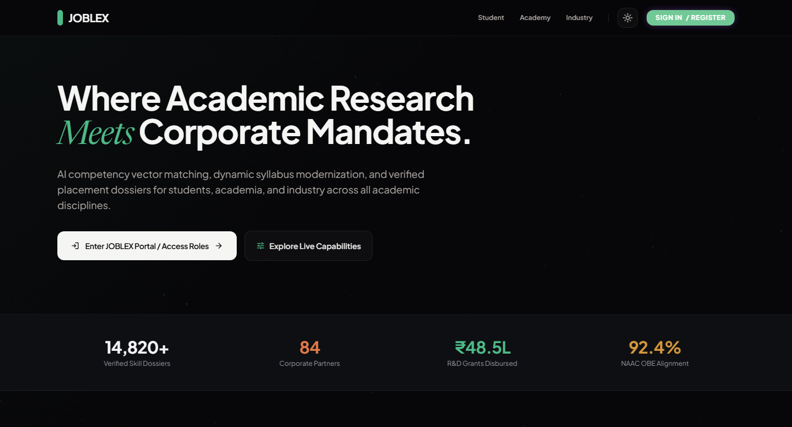
*Figure 1.1: JOBLEX Public Portal Gateway featuring live ecosystem metrics, real-time verified ledger stats, and access gateways.*

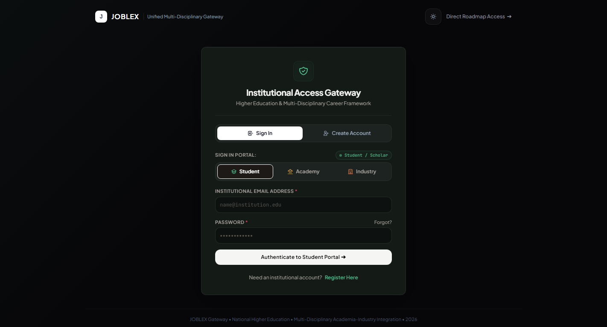
*Figure 1.2: Role-based Authentication & Access Gateway supporting authenticated session switches across Student, Academy, and Industry roles.*

---

### 2. Student Acceleration & Career Intelligence Suite

Designed as a gamified career operating system, the Student Portal tracks experience points (XP), active learning streaks, and competency mastery.

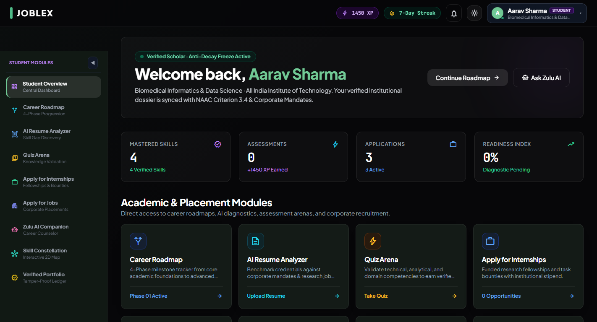
*Figure 2.1: Student Central Command Dashboard illustrating verified skill counters, anti-decay freeze indicators, and institutional alignment metrics.*

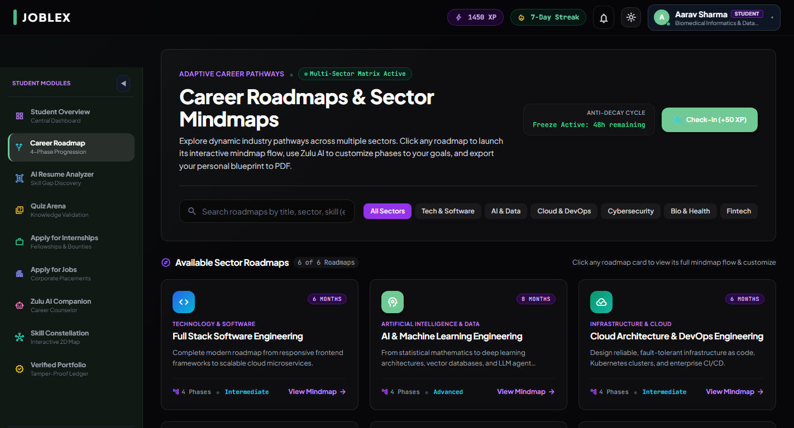
*Figure 2.2: 4-Phase Career Progression Engine guiding candidates through academic foundations, domain masteries, internships, and capstone milestones.*

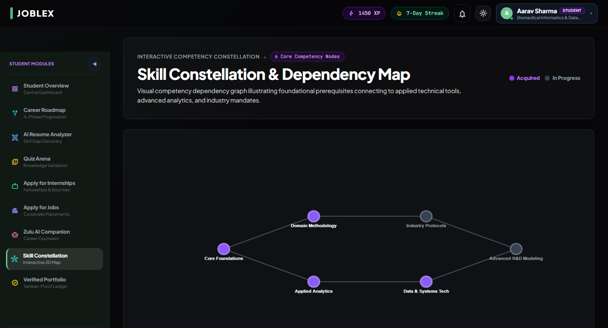
*Figure 2.3: Interactive Skill Constellation mapping prerequisite dependency trees across analytical, laboratory, and software engineering competencies.*

---

### 3. AI-Powered Resume Parser & Zulu AI Companion

JOBLEX integrates generative and natural language processing models to eliminate manual data entry and provide contextual guidance.

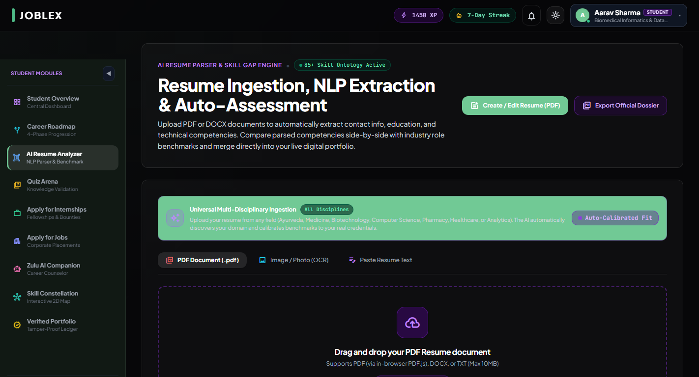
*Figure 3.1: Resume Ingestion & NLP Diagnostic Engine comparing extracted competencies against live corporate role benchmarks.*

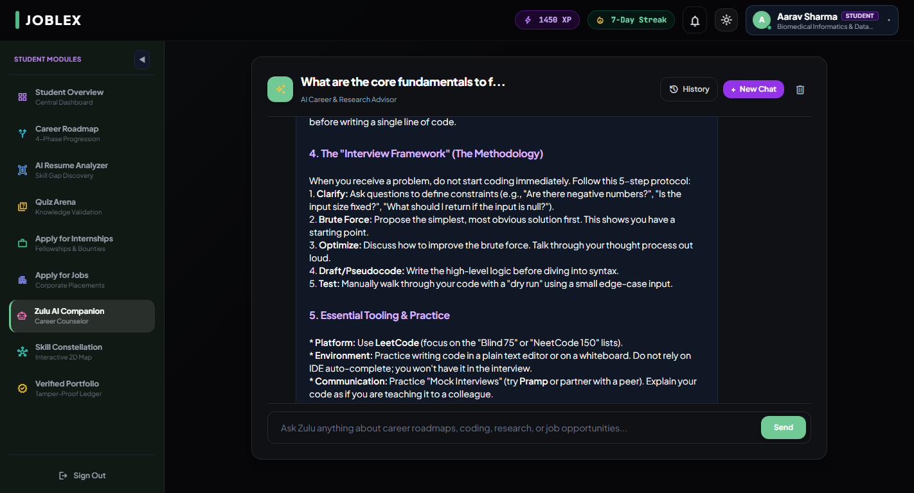
*Figure 3.2: Zulu AI Career & Research Advisor delivering structured interview frameworks, technical walkthroughs, and personalized roadmaps.*

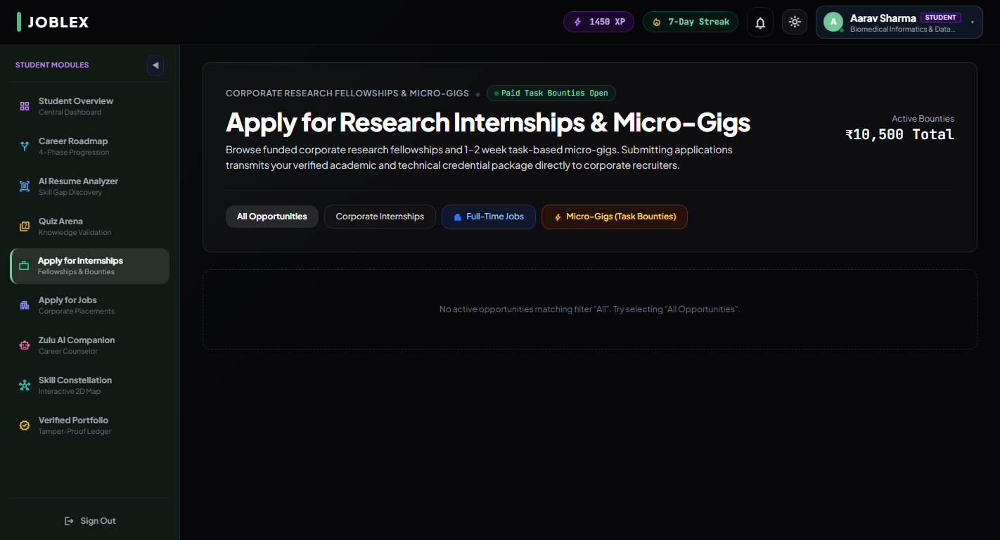
*Figure 3.3: Research Fellowships and Corporate Micro-Gigs board matched directly to student competency profiles.*

---

### 4. Industry Recruiter Command Center & Reverse Talent Sourcing

Recruiters bypass stale resume databases by directly querying verified candidate dossiers, filtered by quantitative match metrics and competency verifications.

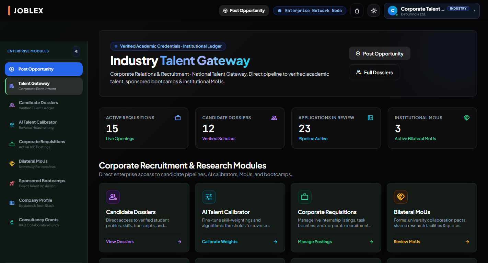
*Figure 4.1: Corporate Recruitment Gateway displaying real-time applicant pipelines, corporate requisitions, and institutional MoUs.*

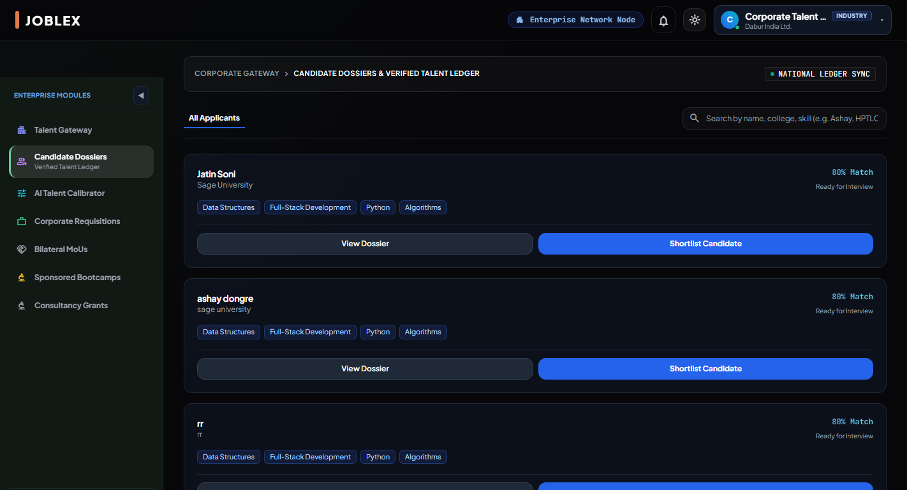
*Figure 4.2: Candidate Dossier Directory featuring radar chart skill visualizations, verified institutional badges, and direct inbound interview invites.*

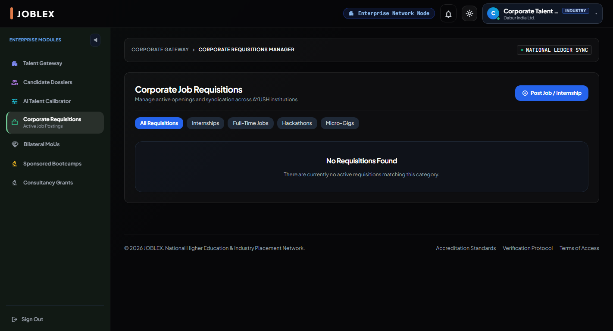
*Figure 4.3: Active Corporate Requisition Hub for configuring candidate thresholds, stipend allocations, and role qualifications.*

---

### 5. Academic Governance & Curriculum Modernization Hub

Equips university administrators with empirical data on institutional performance, cross-college standing, and actionable recommendations for curriculum reform.

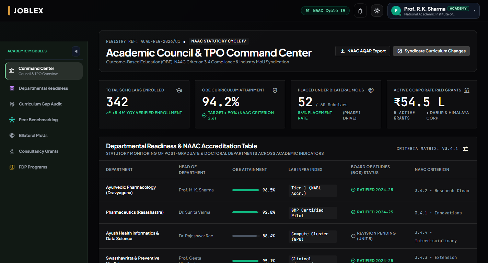
*Figure 5.1: Academic Council & TPO Command Center monitoring departmental readiness, accreditation criteria, and corporate R&D grants.*

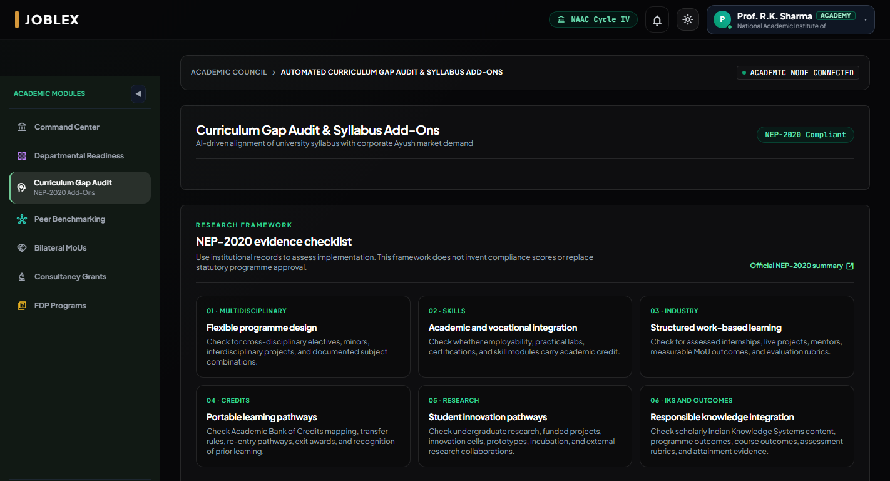
*Figure 5.2: AI-Powered Curriculum Gap Audit identifying emerging industry competencies and recommending syllabus modernizations.*

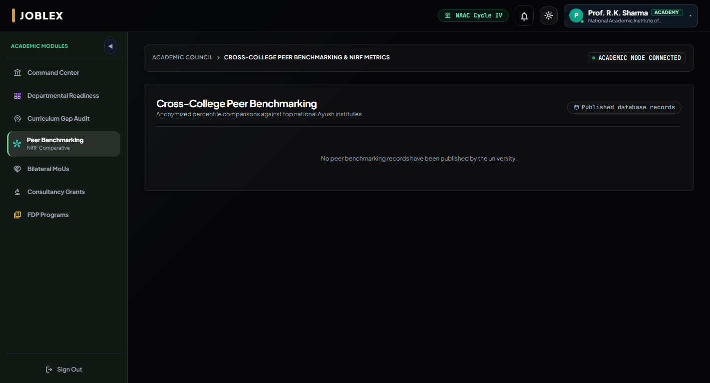
*Figure 5.3: Institutional Benchmarking Matrix comparing cohort skill acquisitions against national percentiles across key academic parameters.*

---

## 🧮 Mathematical & Algorithmic Formulations

JOBLEX relies on rigorous algorithmic models rather than static keyword lookups.

### 1. Hybrid Directional & Overlap Vector Match Engine

Candidate-to-Opportunity compatibility is calculated using a convex combination of cosine similarity (category alignment) and weighted Jaccard index (exact competency overlap):

$$\mathcal{M}(C, O) = \alpha \cdot \cos(\theta_{\mathbf{v}_C, \mathbf{v}_O}) + (1 - \alpha) \cdot \mathcal{J}_w(S_C, S_O)$$

Where:
* **Cosine Directional Vector**: $\cos(\theta) = \frac{\mathbf{v}_C \cdot \mathbf{v}_O}{\|\mathbf{v}_C\|_2 \|\mathbf{v}_O\|_2}$ models semantic alignment across multi-dimensional skill clusters.
* **Weighted Jaccard Index**: $\mathcal{J}_w(S_C, S_O) = \frac{\sum_{s \in S_C \cap S_O} w_s}{\sum_{s \in S_C \cup S_O} w_s}$ measures exact competency fulfillment weighted by employer criticality.
* **Optimal Balance**: Calibrated at $\alpha = 0.6$ for generalized matching, dynamic in the Recruiter Calibrator.

### 2. Skill Retention & Anti-Decay Half-Life Formulation

To prevent credential inflation, unexercised competencies experience continuous logarithmic decay based on Herman Ebbinghaus' retention curves:

$$R(t) = R_0 \cdot e^{-\frac{t - t_0}{\lambda \cdot (1 + \beta \cdot \text{Streak})}}$$

Where:
* $R(t)$ represents the active skill proficiency percentage at time $t$.
* $R_0$ is the initial verification score achieved during assessment.
* $\lambda$ is the domain half-life constant (e.g., 90 days for software frameworks, 180 days for foundational research).
* $\beta \cdot \text{Streak}$ decelerates decay for consistently active students.
* **Anti-Decay Freeze**: Successfully executing verified project bounties freezes decay ($\frac{dR}{dt} = 0$) for up to 60 days.

### 3. Zero-Trust Cryptographic Credential Verification

All micro-credentials, quiz certificates, and portfolio badges generated on the platform are cryptographically sealed:

$$\text{Proof Token} = \text{HMAC-SHA256}\Big(\text{SecretKey}, \; \text{CandidateID} \,\|\, \text{SkillID} \,\|\, \text{Score} \,\|\, \text{Timestamp}\Big)$$

Public third parties can verify authenticity via the `/api/assessment/verify/:token` endpoint without requiring platform authentication.

---

## 🔄 Tri-Directional System Data Flow

The diagram below illustrates the continuous event loop connecting student actions, recruiter evaluations, and university governance updates:

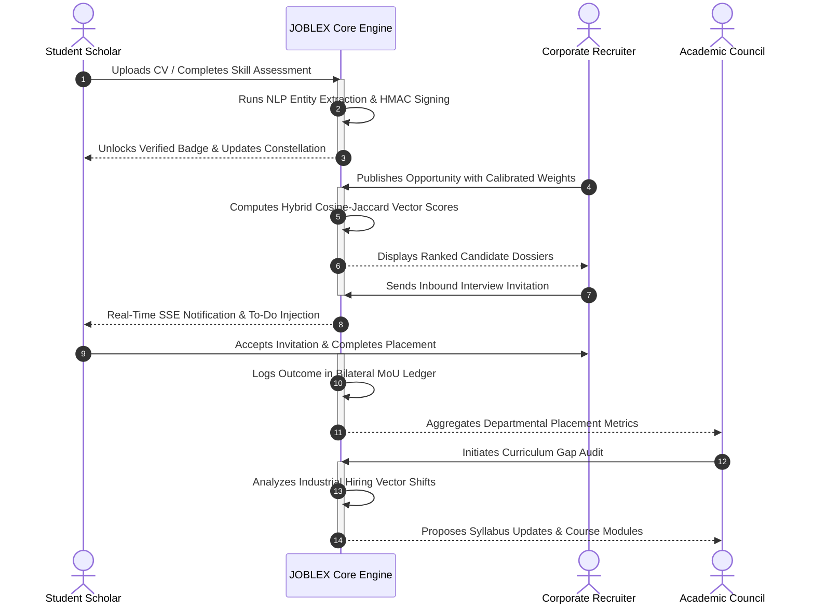

---

## 📡 Core API Service Directory

JOBLEX provides a dual-prefixed (`/api/*` and root-compatible) RESTful interface with live Server-Sent Events (SSE):

| Method | Route Endpoint | Target Subsystem | Functionality & Payload |
| :---: | :--- | :--- | :--- |
| `POST` | `/api/auth/register` | Authentication | Creates user credentials with role metadata and institutional linkage. |
| `POST` | `/api/auth/login` | Authentication | Issues Bearer session token and returns authenticated role profile. |
| `GET` | `/api/roadmap` | Student Portal | Retrieves 4-phase career progression milestones and completed tasks. |
| `POST` | `/api/resume/analyze` | AI Diagnostics | Parses PDF/DOCX resumes, benchmarks against industry ontology. |
| `GET` | `/api/opportunities` | Marketplace | Returns active corporate listings, internships, and research micro-gigs. |
| `POST` | `/api/opportunities/apply` | Marketplace | Submits candidate profile and triggers recruiter SSE event. |
| `GET` | `/api/industry/candidates` | Industry Suite | Fetches anonymized, skill-ranked student dossiers with radar charts. |
| `POST` | `/api/industry/inbound-invite` | Industry Suite | Dispatches direct recruiter invitation to student To-Do queue. |
| `GET` | `/api/academy/all-data` | Academic Council | Fetches institutional readiness tables, grants, and MoU registries. |
| `GET` | `/api/academy/curriculum-gap` | Academic Council | Generates AI syllabus gap audit against market demand vectors. |
| `GET` | `/api/assessment/verify/:token` | Security | Public zero-trust cryptographic HMAC badge verification. |
| `GET` | `/api/notifications/stream` | Real-Time Events | Persistent SSE connection for live notifications and alerts. |

---

## 🛠️ Technical Stack & Implementation Architecture

```
┌─────────────────────────────────────────────────────────────────────────┐
│                           FRONTEND INTERFACE                            │
│  HTML5 · Tailwind CSS (Modern Glassmorphism) · Vanilla ES6+ JavaScript  │
│  Three.js Dynamic 3D Scene Graph · Material Symbols · Canvas Rendering  │
└────────────────────────────────────┬────────────────────────────────────┘
                                     │ JSON / SSE Stream
┌────────────────────────────────────▼────────────────────────────────────┐
│                         APPLICATION BACKEND                             │
│  Primary: Node.js (v20+) with Express Microservices Engine              │
│  Secondary: Python (v3.12+) Flask Multi-Threaded Alternate Server       │
│  Security: HMAC-SHA256, CORS Security Layer, Role-Based Route Guards    │
└────────────────────────────────────┬────────────────────────────────────┘
                                     │ SQL / Realtime Channel
┌────────────────────────────────────▼────────────────────────────────────┐
│                         DATA PERSISTENCE LAYER                          │
│  Cloud: Supabase Managed PostgreSQL with Row-Level Security (RLS)       │
│  In-Memory Fallback: Automated State Engine for Zero-Downtime Demos     │
│  AI Integrations: Google Gemini Flash / NVIDIA API Client Handlers      │
└─────────────────────────────────────────────────────────────────────────┘
```

---

## 🛡️ Project Classification & Governance

* **Classification**: Full-Stack Multi-Portal Web Prototype.
* **Distribution Scope**: Institutional prototype for academia-industry talent automation and curriculum governance.
* **Intellectual Property**: Developed as an open-architecture research and talent infrastructure platform. All rights reserved.
